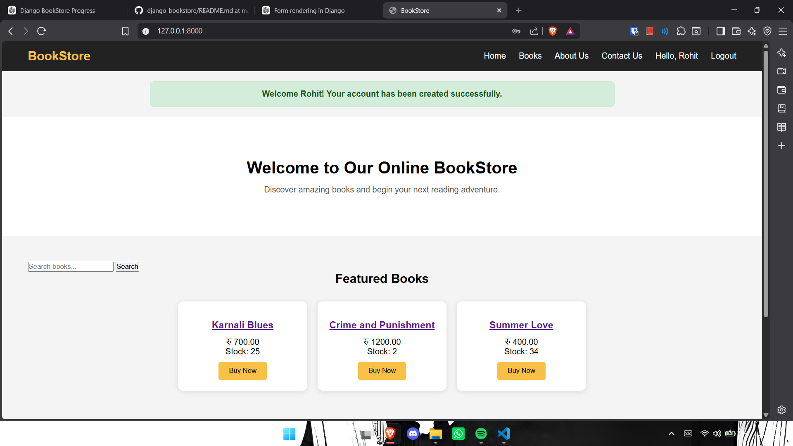
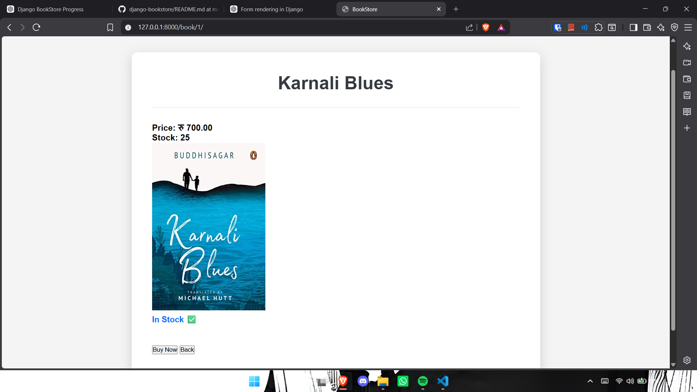
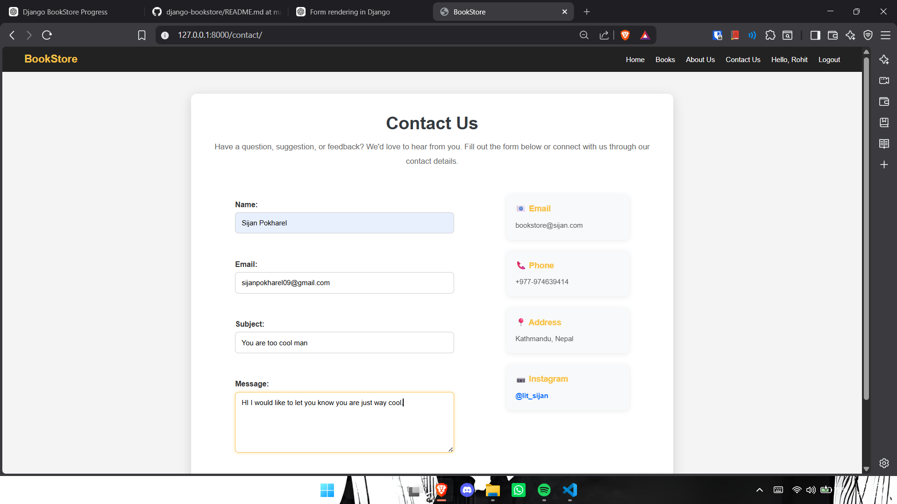
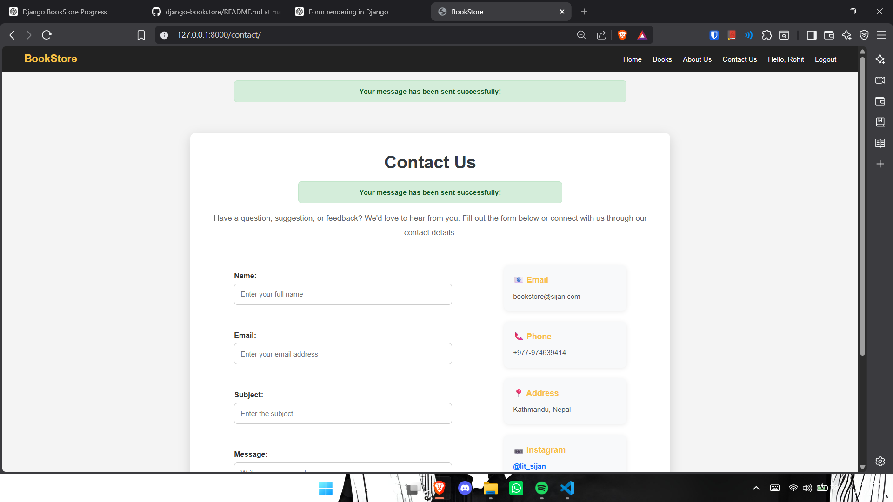
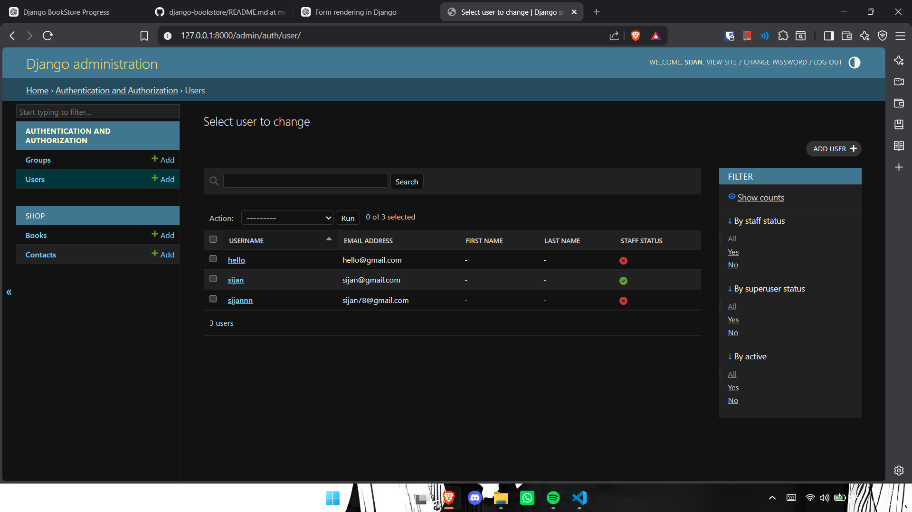

Yooo this is a simple django Bookstore management website.
Here, The major highlights of this project are i learned about creating superuser-admin, making project migrations, building register page through inbuilt django forms and also login/out things.
and many more new things about models, views, static files, img srcs, base and block creations and extensions etc etc 
took me hours learning these 

<<<<<<< HEAD
honerable mention to
LANA DEL REY AND OASIS for providing me their utmost support vibecoding and learning ts fkkk.

## 📸 Screenshots

### Home Page

### Book Detail

### Contact Form

### Contact Success

### Admin Panel

=======
honerable mentions to
LANA DEL RAY AND OASIS for providing me their utmost support vibecoding and learning ts fkkk.

# 📸 Project Screenshots

## 🏠 Home Page

---

## 📖 Book Detail Page

---

## 📬 Contact Form

---

## ✅ Contact Form Success Message

---

## ⚙️ Django Admin Panel

---
>>>>>>> b5c9fd2 (Add Django bookstore project and screenshots)
